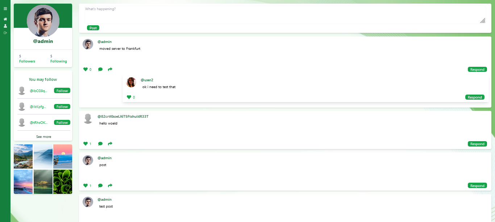
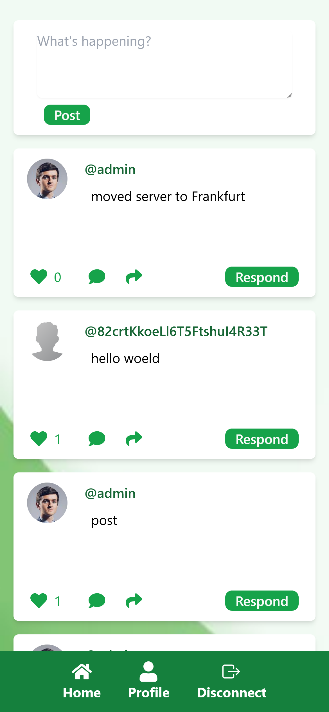

 
    

 

 

 

#### Description :

PHYSYS is a social media app designed for nature enthusiasts who want to share their love of the great outdoors with a like-minded community. Our app is inspired by popular social media platforms such as Twitter, YouTube, and Instagram, and combines the best features of these platforms to create an unique and engaging experience for nature lovers.

#### Demo (does not work on edge):

#### ERD (not the latest):

